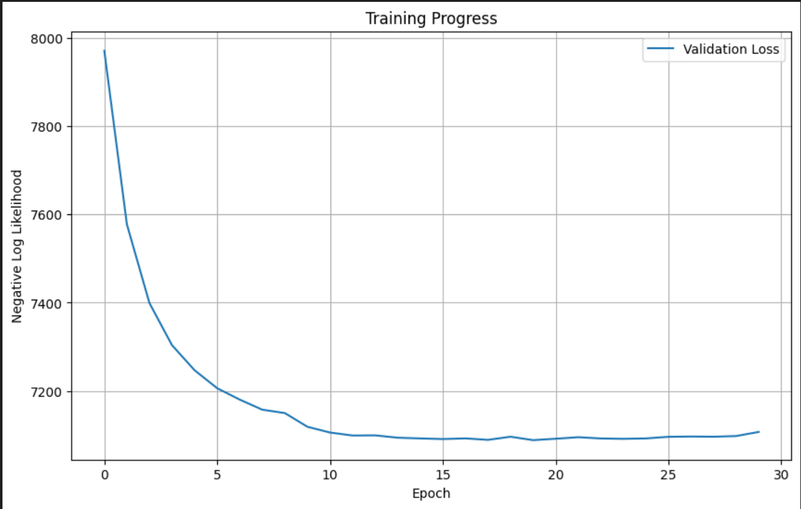
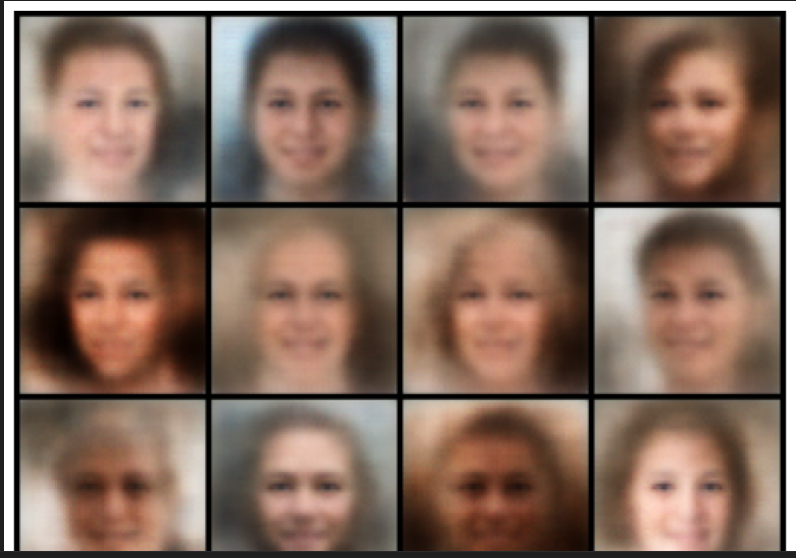

# Beta-VAE Face Generation with FFHQ-64x64

A PyTorch implementation of a Beta-Variational Autoencoder (Beta-VAE) trained on the FFHQ-64x64 dataset to generate realistic human face images. This project demonstrates unsupervised representation learning and probabilistic generative modeling using convolutional encoder-decoder networks.

---

## 🌟 Overview

Variational Autoencoders (VAEs) are probabilistic generative models capable of learning latent representations. This project implements a **Beta-VAE**, a variant that introduces a weighting factor `β` to control the capacity of the latent bottleneck.

This model was trained on the [FFHQ-64x64 dataset](https://huggingface.co/datasets/Dmini/FFHQ-64x64) — a high-quality dataset of aligned and cropped human faces at 64x64 resolution.

---

## 🧠 Key Features

- ✅ Convolutional Encoder and Decoder tailored for 64x64 RGB images  
- ✅ Reparameterization trick for sampling latent vectors  
- ✅ Support for both **Bernoulli** and **Gaussian** likelihoods  
- ✅ Custom PyTorch `Dataset` class using HuggingFace `datasets`  
- ✅ Modular training loop with early stopping and gradient clipping  
- ✅ Evaluation with Negative Log Likelihood (NLL) and KL divergence  
- ✅ Sample generation, image grid visualization, and loss plotting  

---

## 🖼️ Results

### 📉 Validation Loss Curve  

  

### 🧑‍🤝‍🧑 Generated Face Samples  

  

---

## 🗃️ Dataset

We used the **[Dmini/FFHQ-64x64](https://huggingface.co/datasets/Dmini/FFHQ-64x64)** dataset available on Hugging Face. The dataset contains **70,000+** high-quality human face images resized to 64×64 resolution.

---
